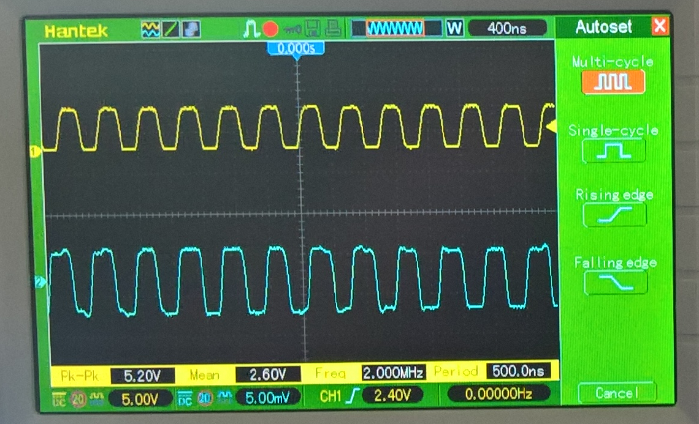

# HZ-Maker
This project contains the source code needed to configure a PIC16F18313 as source of timing for a simple microprocessor (like the 6502 or 65C02) and a serial chip (like the 6551/65C51 ACIA). It also emulates the function of the DS1813 'EconoReset' by providing a clean reset control signal to the target CPU and peripheral chips.

Using a PIC means that several discrete components can be replaced by a single 8 pin micro controller which is cheaper and requires less board space.

In the simplest configuration all you need is a 16F18313, and a 100nF decoupling capacitor. In this mode the PIC internal high speed RC oscillator is used to generate the output clock signals with a +/-1% accuracy.

If you add a 8Mhz external timing crystal with suitable load capacitors (typically 22pF) then the accuracy of the output signals will be higher.

If you want to add a manual reset button then a normally open tact type switch can be added to reset the PIC.

An example schematic for circuit showing the pins used for each of the signals is included
the in 'schematic' folder.

## Current Status

I've built a test circuit on a breadboard and the latest code in this repository produces the wave forms shown in the following image on my oscilloscope.

The yellow trace is the 2Mhz signal and the blue is the ~1.8432Mhz clock output for an ACIA. I am not entirely convinced that the external oscillator has the right load capacitors but I have seen the fail over clock switching occurring. More testing on a soldered board is needed.
